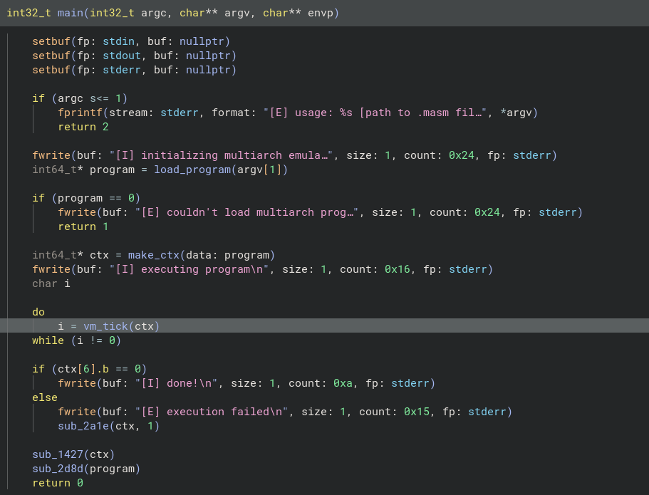
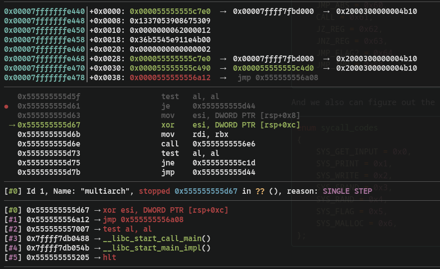
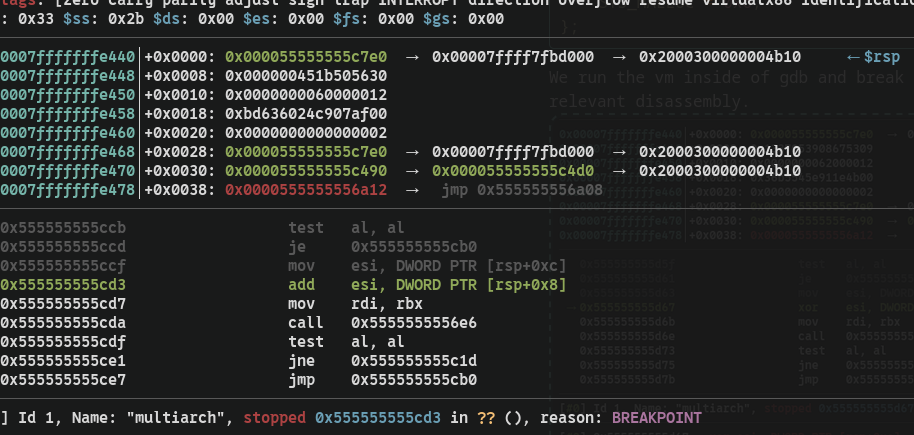

+++
title = "Multiarch 1"
date = 2025-07-21
authors = ["rishit khandelwal"]
+++

We are given a binary called `multiarch` and another binary file called `crackme.masm`.


The `make_ctx` function gives us information about the runtime of the VM via a struct containing the context.


The other information about the context, can be gained from `stack_trace` function


```c
struct Context
{
    void *mmap_sec_1;      
    void *mmap_sec_2;     
    void *mmap_sec_3;    
    void *__wierd_calloc__;              
    char reserved_1[8];            
    void *getenv_callback;
    bool trigger_exception; 
    bool permission_syscall;
    uint8_t eflag;         
    uint32_t memory_offset;
    uint32_t stack_offset;
    uint32_t mA;         
    uint32_t mB;        
    uint32_t mC;       
    uint32_t mD;      
};
```

These are all the parameters in the VM Context.

The VM runs in 2 modes: Stack and Register.

This function is looped over until either one of the functions returns a 0 (which is ig a `hlt` instruction equivalent).

We can explore `handle_stack_vm` and get these opcodes from analysing each branch.

```c
enum stack_vm_opcodes
{
    S_LDB = 0x10,
    S_LDW = 0x20,
    PUSH_STACK = 0x30,
    S_LDP = 0x40,
    POP_STACK = 0x50,
    ADD = 0x60,
    SUB = 0x61,
    XOR = 0x62,
    AND = 0x63,
    JMP = 0x70,
    JZ = 0x71,
    JNZ = 0x72,
    CMP = 0x80,
    SYSCALL = 0xA0,
    S_HLT = 0xFF,
};
```

We can similarly look into the `handle_reg_vm` function and get information about the opcodes from there.

```c
enum reg_vm_opcodes
{
    REG_HALT = 0x0,
    REG_SYSCALL = 0x1,
    REG_PUSH = 0x10,
    PUSH_REG0 = 0x11,
    PUSH_REG1 = 0x12,
    PUSH_REG2 = 0x13,
    PUSH_REG3 = 0x14,
    POP_REG0 = 0x15,
    POP_REG1 = 0x16,
    POP_REG2 = 0x17,
    POP_REG3 = 0x18,
    ADD_REG = 0x20,
    ADD_IMM = 0x21,
    SUB_REG = 0x30,
    SUB_IMM = 0x31,
    XOR_REG = 0x40,
    XOR_IMM = 0x41,
    MUL_REG = 0x50,
    MUL_IMM = 0x51,
    JMP_ABS = 0x60,
    CALL = 0x61,
    JZ_REG = 0x62,
    JNZ_REG = 0x63,
    JMP_FLAG2 = 0x64,
    JMP_IMM = 0x68,
};
```

And we also can figure out the syscall codes.

```c
enum sycall_codes
{
    SYS_GET_INPUT = 0x0,
    SYS_PRINT = 0x1,
    SYS_WRITE = 0x2,
    SYS_SRAND = 0x3,
    SYS_RAND = 0x4,
    SYS_FLAG = 0x5,
    SYS_MALLOC = 0x6,
};
```

We run the vm inside of gdb and break out at the first task, and skip instructions until we reach some operator, then see the relevant disassembly.


We can see that `[rsp+0x8]` and `[rsp+0xc]`, are xor-ed together, and after that it calls another function at some address, which if we follow its execution, we see that it makes multiple syscalls and then we see that there is another operation


This is another operation where `[rsp+0x8]` and `[rsp+0xc]` are added.

Skipping further ahead, we observe  that some values are loaded `edx` which is subtracted from `0xaaaaaaaa`.
We can ignore the other instructions and notice that  where there is a `cmove` instruction. Lets go to where it would have taken us by providing a value such that it passes `test esi, esi`

First there is an xor between constants `0x8675309` and `0x13370539`, and then the result is stored.
This result is added to our input and stored. The result of this operation is then subtracted from `0xaaaaaaaa` as mentioned above which triggers an exception if the difference is non-zero. So we have to figure out a input which would be equal to `0xaaaaaaaa` after this bunch of operations. Simply entering these values in python and solving for the input gives us `0x8f5a547a` or 2405061754.

If we give this as an input to the first challenge, we pass it and reach the 2nd challenge "Tell me a joke"
